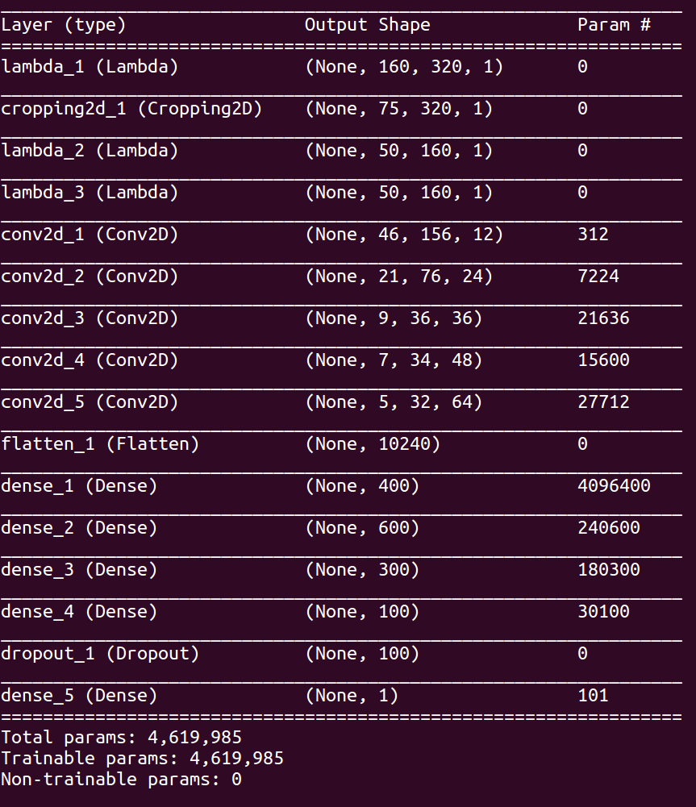
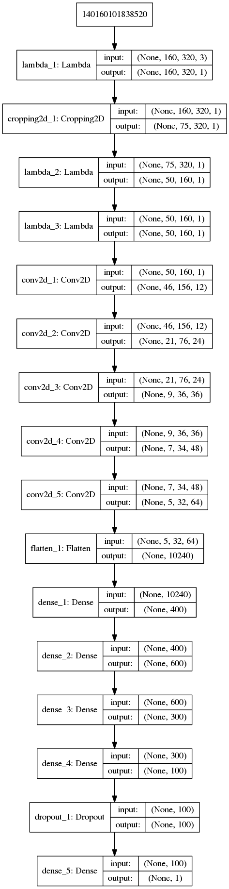
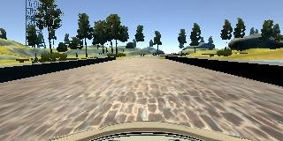
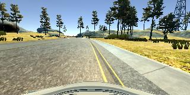
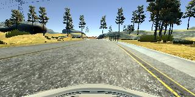
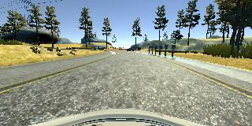

# **Behavioral Cloning** 

## Writeup Template

**Behavioral Cloning Project**

The goals / steps of this project are the following:
* Use the simulator to collect data of good driving behavior
* Build, a convolution neural network in Keras that predicts steering angles from images
* Train and validate the model with a training and validation set
* Test that the model successfully drives around track one without leaving the road
* Summarize the results with a written report

## Rubric Points
### Here I will consider the [rubric points](https://review.udacity.com/#!/rubrics/432/view) individually and describe how I addressed each point in my implementation.  

---
### Files Submitted & Code Quality

#### 1. Submission includes all required files and can be used to run the simulator in autonomous mode

My project includes the following files:
* model.py containing the script to create and train the model
* drive.py for driving the car in autonomous mode
* model.h5 containing a trained convolution neural network 
* writeup_report.md summarizing the results

#### 2. Submission includes functional code
Using the Udacity provided simulator and the drive.py file, the car can be driven autonomously around the track by executing 
```sh
python drive.py model.h5
```

#### 3. Submission code is usable and readable

The model.py file contains the code for training and saving the convolution neural network (model.py lines 45 to 129), in addition to some additional functionality (model.py lines 39 to 43 and 131 to 179). The file shows the pipeline I used for training and validating the model, and it contains comments to explain how the code works. I used a generator to pull images from the disk one batch at a time (as it isn't practical to read the entire set of training/validation data into memory at once). The generator code cad be seen in file_contents_gen.py on lines 105 to 171 (generator function multi_dir_data_gen).

### Model Architecture and Training Strategy

#### 1. An appropriate model architecture has been employed

The model architecture consists of a convolution neural network based on the NVIDIA End-to-End SDC network detailed [here](https://devblogs.nvidia.com/deep-learning-self-driving-cars/). This is a convolutional architecture, which seems well suited to the task of exporting steering angle from image data since convolutional neural networks are good at extracting features. The NVIDIA Architecture has the following structure:

- Input: Colour image 3 channels size 66 by 200 (YUV Colour Space)
- Normalization: Same size as input
- Conv2D: Kernel 5x5, VALID padding, Stride 2x2, 24 layers
- Conv2D: Kernel 5x5, VALID padding, Stride 2x2, 36 layers
- Conv2D: Kernel 5x5, VALID padding, Stride 2x2, 48 layers
- Conv2D: Kernel 3x3, VALID padding, Stride 1x1, 64 layers
- Conv2D: Kernel 3x3, VALID padding, Stride 1x1, 64 layers
- Flattening Layer
- Fully Connected: 1164 to 100
- Fully Connected: 100 to 50
- Fully Connected: 50 to 10
- Fully Connected: 10 to 1

Keras model summary (`model.summary()`) output:



The model definition is at model.py from lines 47 to 99.

The model includes RELU layers to introduce nonlinearity (code line 20), and the data is normalized in the model using a Keras lambda layer (code line 18). 

#### 2. Attempts to reduce overfitting in the model

The model contains dropout layers in order to reduce overfitting (model.py line 93). Also, while training I adjusted the number of training epochs, looking for the number that would yield consistent improvements in both training and validation accuracy. The larger the number of epochs, the greater the change that the training loss would get to its minimum and the validation accuracy would stop improving (loss would stop decreasing).

The model was tested by running it through the simulator and ensuring that the vehicle could stay on the track. This was done in place of forming a test set of data.

#### 3. Model parameter tuning

The model used an adam optimizer, so the learning rate was not tuned manually (model.py line 25). I also tuned the bias that I added to the left and right camera images (I include more details on this later in this writeup).

#### 4. Appropriate training data

Training data was chosen to keep the vehicle driving on the road. I used a combination of center lane driving (the set supplied by Udacity), repeated left turns (the hard left with the dirt on the right), and recovering from the left and right sides of the road through the hard turn. In addition, I used the left and right camera images to improve the centering performance of the car.

For more details about how I created the training data, see the next section. 

### Model Architecture and Training Strategy

#### 1. Solution Design Approach

The overall strategy for deriving a model architecture was to adapt the NVIDIA architecture to fit the problem. I thought this model would be appropriate because it was designed specifically for this task. The network has convolutional components and is therefore well suited to image analysis, since CNNs have the ability to extract features from the images. The fully connected layers that follow the convolutional ones are something like a controller (they produce a steering angle output based on the observed features). As stated in the [NVIDIA Paper](https://arxiv.org/pdf/1604.07316v1.pdf) in the last paragraph of Section 4, it is actually not possible to say with certainty that the feature detection and controller functions are located in the convolutional and fully connected layers, respectively. There might be some interplay.

I adjusted sizes and strides only. I tweaked these parameters by trial and error. In particular, I adjusted the strides of the first layer, the depths of the convolutional layers, and the widths of the fully connected layers. In addition, I used greyscale data instead of colour data, since I figured I would be able to steer the car based on greyscale images so the network should be able to as well. I assumed that greyscale images would require smaller fully connected layers and shallower convolutional layers. In addition, they should have the benefit of faster inference time and shorter training periods.

In order to gauge how well the model was working, I split my image and steering angle data into a training and validation set. I found that my first model had a low mean squared error on the training set but a high mean squared error on the validation set. This implied that the model was overfitting. 

To combat the overfitting, I modified the model so that it included dropout. I adjusted the sizes of the fully connected layers accordingly, similarly to the strategy I used in Project 2 (German Traffic Signs Classifier).

After I performed these adjustments, I added the preprocessing steps to the architecture, including RGB to greyscal conversion followed by cropping, then a resize.

The final step was to run the simulator to see how well the car was driving around track one. There were a few spots where the vehicle fell off the track. This architecture actually ended up being the final architecture. I tried adjusting the architecture, making the fully connected layers far deeper and adjusting the convolutional layer parameters. This didn't really improve performance though, it just make the network slower to train. So, I reverted my changes to what would be the final architecture. At this point, I assumed that the training set was the problem, not the architecture. So, I moved on to adjusting the training data and training process, which is described in the last section of this report. The architecture turned out to require no additional improvement.

After the architecture and training data/process modification, the vehicle is able to drive autonomously around the track without leaving the road.

#### 2. Final Model Architecture

The final model architecture (model.py lines 47-99) consisted of a convolution neural network with the following layers and layer sizes:

- Input: Greyscale image 3 channel height 160 width 320, RGB colour space
- Preprocessing 1: Convert to greyscale (1x160x320)
- Preprocessing 2: Crop 60 pixels off the top and 25 pixels off the bottom (1x75x320)
- Preprocessing 3: Resize the image to (1x50x160)
- Preprocessing 4: Normalize the image (max and min to range -1.0 to 1.0), still size (1x50x160)
- Conv2D: Kernel 5x5, VALID padding, Stride 1x1, RELU Activation, 12 layers (12x46x156)
- Conv2D: Kernel 5x5, VALID padding, Stride 2x2, RELU Activation, 24 layers (24x21x76)
- Conv2D: Kernel 5x5, VALID padding, Stride 2x2, RELU Activation, 36 layers (36x9x36)
- Conv2D: Kernel 3x3, VALID padding, Stride 1x1, RELU Activation, 48 layers (48x7x34)
- Conv2D: Kernel 3x3, VALID padding, Stride 1x1, RELU Activation, 64 layers (64x5x32)
- Flattening Layer (10240)
- Fully Connected: 400
- Fully Connected: 600
- Fully Connected: 300
- Fully Connected: 100
- Dropout
- Fully Connected: 100 to 1

Here is a visualization of the architecture produced by keras.



#### 3. Creation of the Training Set & Training Process

I first trained the model on the center images in the Udacity provided set. After this training on this data, the car made it through part of the first left turn. I then implemented data augmentation by horizontally mirroring the image data and multiplying the associated steering angles by -1. This again improved performance. At this stage the car was able to drive fairly well around the first turn, but was unable to recover if it got off center.

Then, I included the left and right camera images and applied biases such that a corrective steering action would be applied. A negative steering angle turns the car left, and a positive steering angle turns the car right. So, for the left camera image, I added a positive bias, indicating that the car should turn more to the right if the center camera was in the left camera's position. Similarly, I added a negative bias to the steering angle associated with the right camera angles. This worked extremely well, and after training with the new data the car would exhibit something like 'line follower' behaviour - as soon as it deviated from the path driven in the training data, it would sharply correct. I played with the bias number, and found that the response was tunable depending on the bias applied. A bias of 1.0 in each direction for the left and right cameras resulted in a jerky center line follower response. 0.5 was more reasonable, I think that the bias could be adjusted to be speed dependent to make driving smooth at all speeds (likely need a larger bias at slower speeds). I also performed the 'horizontal flip' and steering angle negation on the left and right camera angles. Therefore, I was able to increase the size of my data set by a factor of 6 fairly easily. Here is an example of flipping the image:




If the steering angle for the image on the left (the original image) was 1.0, the steering angle for the image on the right would be -1.0.

Once I did the above, the car made it over the bridge reliably, but exited the track onto the dirt road (it didn't turn left hard enough). To fix this, I recorded data only on that turn, 5 or 6 times. Then, I took my existing model and trained it on this new data, using the same data augmentation process. The car then successfully navigated the turn. I was quite surprised that was all it took, and really felt like deep learning was a possibly practical technique after experiencing this. I also drove some runs that were intended to enable the model to correct itself if it got off track. Here are 3 pictures that demonstrate a recovery:





I did not record any data on track 2, although that likely would have made the network more generic. I also did not test on track 2. 

The Udacity set contains 24 108 images. My addition data for the hard left hander with the dirt path on the right midway through the turn contains 4 755 images. This is a total of 28 863 data points. With data augmentation, I had 173 178 pairs of images and steering angles. I build the data preprocessing into the network architecture by using Keras lambdas and RGB to greyscale conversion, as described above. 

I finally randomly shuffled the data set and put 20% of the data into a validation set. I used this training data for training the model. The validation set helped determine if the model was over or under fitting.

I am fairly certain that creation of the training set and the training process were the key parts of this project, especially since the NVIDIA architecture is so well suited to the problem.